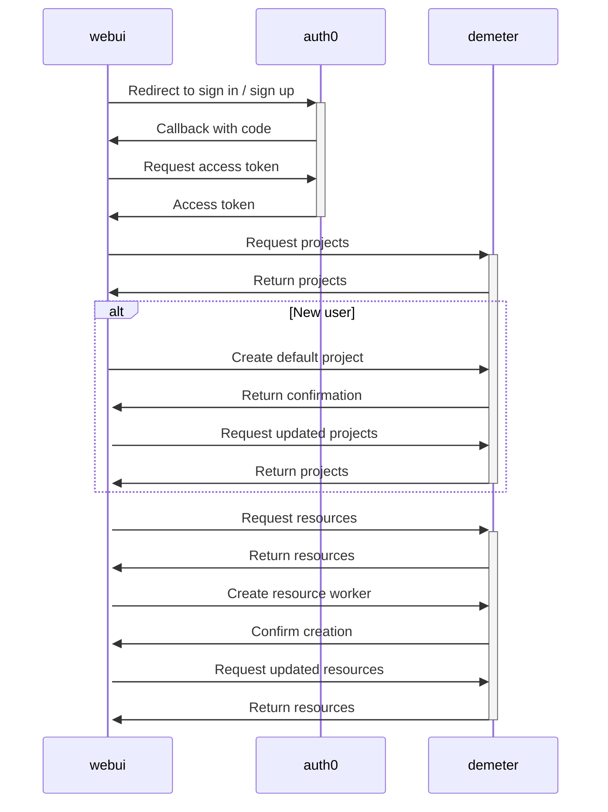

# Custom Demeter UI

This project demonstrates how to implement a custom web UI for Demeter.

## Overview

Demeter exposes a gRPC-based API, with protocol buffers defined in the `spec` folder. Additionally, Demeter uses Auth0 for authentication. This example includes a complete OAuth2 flow that connects to Auth0, retrieves user tokens, and uses them to interact with the Demeter gRPC API.

## Authentication & Interaction Flow

The following sequence diagram illustrates the authentication process and how the frontend interacts with Demeter:



## Development

### Prerequisites

- [pnpm](https://pnpm.io/)
- You must request Auth0 credentials before running the application. Once obtained, create a `.env` file in the root directory with the following environment variables:

```env
AUTH0_CALLBACK_URL="http://localhost:3000/callbacks/auth0"
AUTH0_CLIENT_ID="ID"
AUTH0_CLIENT_SECRET="SECRET"
AUTH0_DOMAIN="txpipe.us.auth0.com"
COOKIE_SECRET="SECRET"
```

### Generating TypeScript Code from gRPC Spec

To generate the TypeScript client code from the protobuf definitions:

```sh
cd spec
pnpm install
pnpm run build
```

The generated `.ts` files will appear inside the `app` folder.

### Starting the Development Server

Once the code has been generated, start the development server:

```sh
pnpm run dev
```

> Once running, the app will be available at: [http://localhost:3000](http://localhost:3000)

